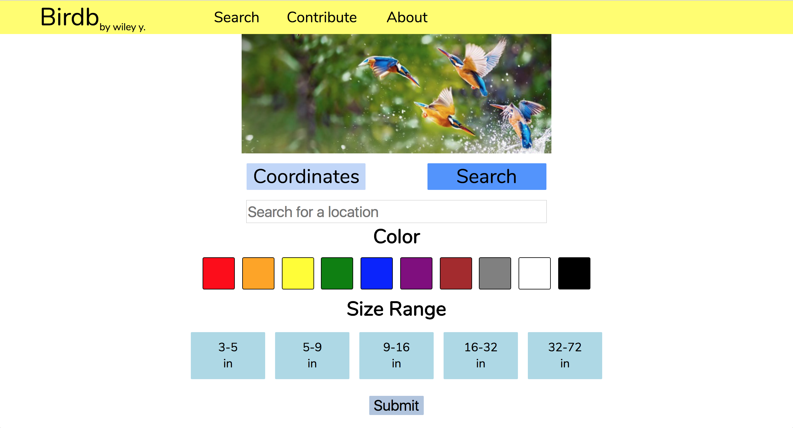

# Repo. for Birddb



Since my hosting credit ran dry, here is the source.

## What is Birddb?

It was my high school capstone project. Basically, I created my own bird identification search engine using information scraped from crowd-sourced websites. A user could identify a bird by passing in color, location, and size to the engine. Pretty rad!

## Does it work?

Well, kinda. Crowd-sourced information is not always accurate, and I had to use a primitive language-processing algorithm to extract the bird's colors and sizes from the websites. To fix these problems, I added a polling system where users can "vote" to correct a bird's color.

This system solves the problem of birds with *incorrect* information, so I also added a Contribute page for birds with *incomplete* information.

## Can I try it out?

Unfortunately, I ran out of hosting credit, so no. I might upload some other videos and prototypes later though.

## Dependencies

* Django
* Requests
* Python3

## Notes on deploying the server

Need to mess around with xenocano/settings.py to get ready for prod.

You also need to set the enviroment variable `DJANGO_KEY`

## Recommendations

* Set `DEBUG` to `False` in settings.py
* Enable Django's template caching
* Set up another database, such as postgres

### FOLLOW THESE EXTREMELY LIMITED STEPS AT YOUR OWN RISK
### THERE IS UNDOUBTEDLY MORE STEPS THAT I PROBABLY FORGOT ABOUT

## A quick guide for quick set up (don't run on prod. before doing above steps)

```
python manage.py createcachetable
python manage.py collectstatic
DJANGO_KEY='MYCOOLKEY' python manage.py runserver
```
